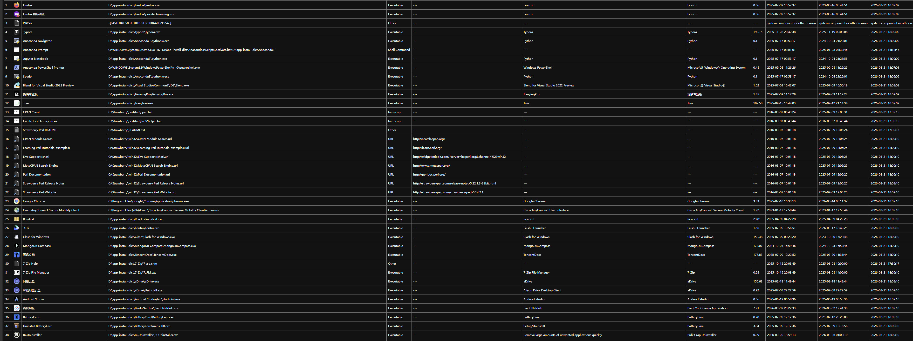

# `GetYourWinApp`

## 引言

天下苦 windows 应用管理久矣！

- 你还在为各种应用的安装位置的检视而苦恼吗？
- 你还在为开始菜单残缺不全的应用目录而捶胸顿足吗？
- 你还在为系统设置-应用内堪称💩的应用管理界面而烦恼不已吗？
- 你还沉浸在 `shell:AppsFolder` 的不多也不少的精准应用视图里，但是为其卡顿的滑动和麻烦的快捷方式嵌套而暗自叹息吗？

...

- 故事的起源：不久前，我想检查我的APP们是否都乖乖地待在 D 盘。于是，我打开了 windows 内置的`系统设置-应用`界面：里面对应用进行磁盘分区的功能，以及应用的完整度，不能说是差强人意，只能说是一坨🔟💩。
- 故事的开始：考虑到熟悉 Windows 应用管理的人大多会通过访问`shell:AppsFolder`虚拟视界来查看和管理应用。于是，此项目诞生了。

`GetYourWinApp`是一个极其简易但是好用的 WinAppInventory 工具，旨在**深度扫描、提取并可视化 Windows 系统中安装的所有应用程序**（包括 UWP 应用、传统可执行程序、系统快捷方式导向应用、Shell 命令导向应用、URL web document 导向应用，等等各种 APP），并为用户提供可视化的列表，展示所有已安装程序的各方面信息。

## 🚀 核心功能

- **全量扫描**：访问 `shell:AppsFolder`，覆盖 UWP 应用等各种应用。
- **深度解析**：识别快捷方式 的真实目标路径，自动解析通过 cmd.exe 或 .bat 脚本启动的复杂应用路径. 适配不同种类的 app.
  - `.exe`
  - `.url`
  - `.html`
  - `https://...`
  - `Shell Command`
  - `system component`
  - ...
- **元数据提取**：获取应用名称、应用路径、应用文件类型、应用文件大小、产品名称、应用文件描述以及文件三时（创建、修改、访问时间）。
- **多格式导出**：`app_list.csv`  &&  `app_list.html`.

## ❗️ 项目特色

- 相比较那些软件卸载工具，本工具提供清晰简要的视图，以及对应用更精准实用的嗅探，不会囊括更为底层的系统组件的同时，也不会丢失任何您希望寻找的应用。
- 相比较那些 windows 系统管理工具，本工具提供集中而轻量的功能，和真实依赖于 `shell:AppsFolder` 的准确答案。

## 📸 效果展示

运行后，你将获得如下内容：

- app_icons/：您的应用图标库。
- app_list.html：在浏览器中查看您的应用列表。
- app_list.csv：在表格编辑器中查看您的应用列表。

## 🛠️ 环境要求

- **操作系统**：Windows 10 / 11。
- **执行环境**：PowerShell 5.1 或更高版本。
- **相关依赖**：程序需要加载 `System.Drawing` 用于处理图标，您的电脑默认已安装。

## 📖 使用教程

1. 下载 inventory.ps1 脚本到本地（或使用提供的可执行程序）。
2. 以管理员权限运行 PowerShell，导向到脚本所在地。
3. 设置执行策略：`Set-ExecutionPolicy -ExecutionPolicy RemoteSigned -Scope CurrentUser`。
4. 执行脚本：`.\GetYourWinApp.ps1`。
5. 等待执行完成，约 10-20 sec(可执行文件执行完成后，会启动窗口供用户确认). 
6. 查收您的内容：脚本或可执行程序会在当前目录下生成 `app_list.html` `app_list.csv` 和 `/app_icons`。

tips: 脚本始终保持最新版，.exe 文件可能不会及时更新。

## 📜 许可证

[MIT License](https://www.google.com/url?sa=E&q=LICENSE) 

------